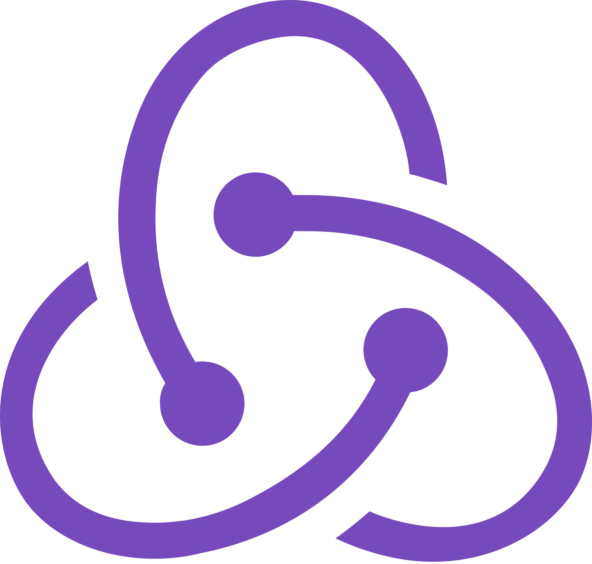

<h1 style="font-size: 2.5rem; font-weight: bold; text-align: center;" align='center'>
   Hello World! 
</h1>

  
  

  👦🏻 <strong>Luis Alvarez</strong> | 👨‍💻 <strong>Software Developer</strong> | 🇲🇽 Mexico

## About Me

- 👨‍💻 I'm a passionate **Frontend Developer**.
- 🌱 Currently learning about **new technologies and more**.
- 💙 I love practicing with **[Frontend Technologies💻](https://github.com/mrLuisFer)**.
- 🌟 You can check out my projects on **[GitHub](https://github.com/mrLuisFer?tab=repositories)**.
- 📝 Feel free to ask me about **HTML, CSS, JavaScript**, and more!
- 📫 Reach me on **[LinkedIn](https://www.linkedin.com/in/mrluisfer/)**, **[GitHub](https://github.com/mrLuisFer)**, or via email: [💼 mrluisfeer@gmail.com](mailto:mrluisfeer@gmail.com).
- 🗨️ Let's connect and **chat over coffee** ☕.
- ☁ I also enjoy learning and writing articles on **[Dev.to](https://dev.to/mrluisfer)**.

## 🏆 GitHub Trophies

## 📚 My Stack

  
  
  
  
  
  
  
  
  
  
  
  
  
  
  
  
  
  
  
  

  ✨✨✨✨✨✨✨✨✨✨✨✨✨✨✨✨✨✨✨✨✨✨✨

|  |  |
| ---------------------------------------------------------------------------------------------------------------------------------------------------- | -------------------------------------------------------------------------------------------------------------------------------------------------------------- |

