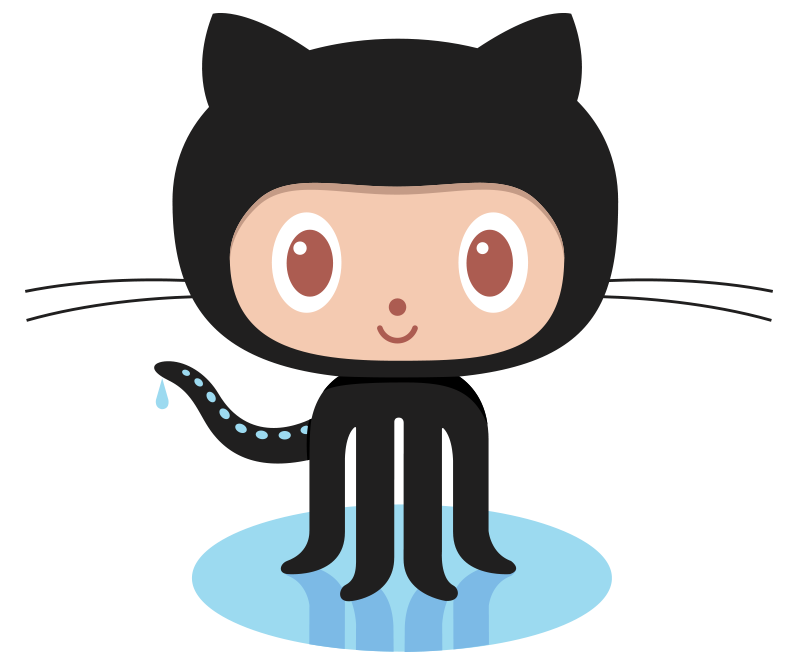

<h1 style="font-size: 2.5rem; font-weight: bold; text-align: center;" align='center'>  Hello World! </h1>

  
  
  
  
  

👦🏻 Luis Alvarez | 👨‍💻 Frontend Developer | 🌮 Mexico

<h2 style="display: flex; align-items: center; margin-bottom: 1rem;"> About Me</h2>

- 👨‍💻 I'm a passionate Frontend Developer

- 🌱 I'm currently learning about **new technologies and much more**

- 💙 But I always like to practice with **[Frontend Technologies💻](https://github.com/mrLuisFer)**

- 🌟 My projects are in **[github/mrLuisFer](https://github.com/mrLuisFer?tab=repositories)**

- 💬 I like to spend time in Twitter **[twitter.com/\_mrluisfer](https://twitter.com/lolesuncrak?s=09)**

- 📝 Ask me about **HTML, CSS and JavaScript** and more...

- 📫 You can contact me by **[Linkedin](https://www.linkedin.com/in/mrluisfer/)**, **[Github](https://github.com/mrLuisFer)**, **[Twitter](https://twitter.com/lolesuncrak)**,etc as mrLuisFer or by email: <a href="mailto:mrluisfeer@gmail.com" >💼 mrluisfeer@gmail.com</a>

- 🗨️ Send me a message **for talk** ☕

- ☁ I also like to write articles on **[Dev.to](https://dev.to/mrluisfer)**</li>

- 🎧 Listening to: 

## 🏆GitHub Trophies

<h2 style="margin: 1rem 0;">📚 My Stack<h3>

 
 
 
 

 
 
 
 
 
 
 
 

  

  ✨✨✨✨✨✨✨✨✨✨✨✨✨✨✨✨✨✨✨✨✨✨✨

  
<!--
 
  

-->

|  |  |
| ------------------------------------------------------------ | ------------------------------------------------------------ 
|  |  |

  

